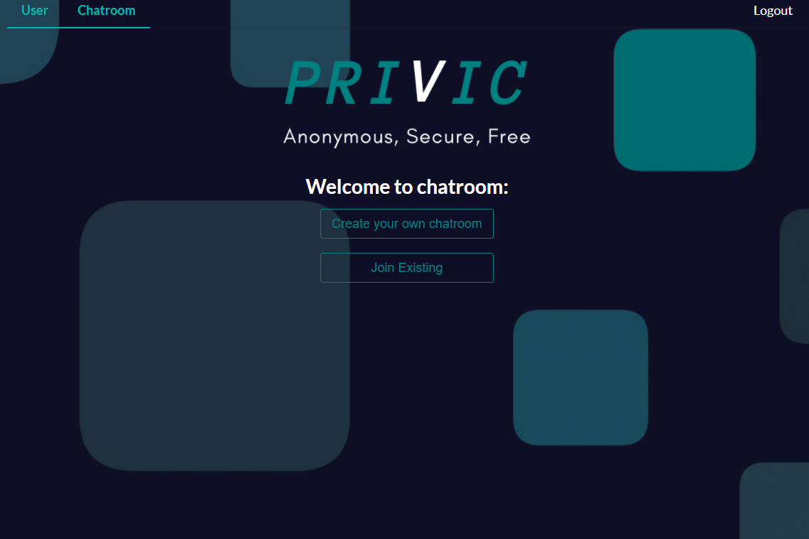
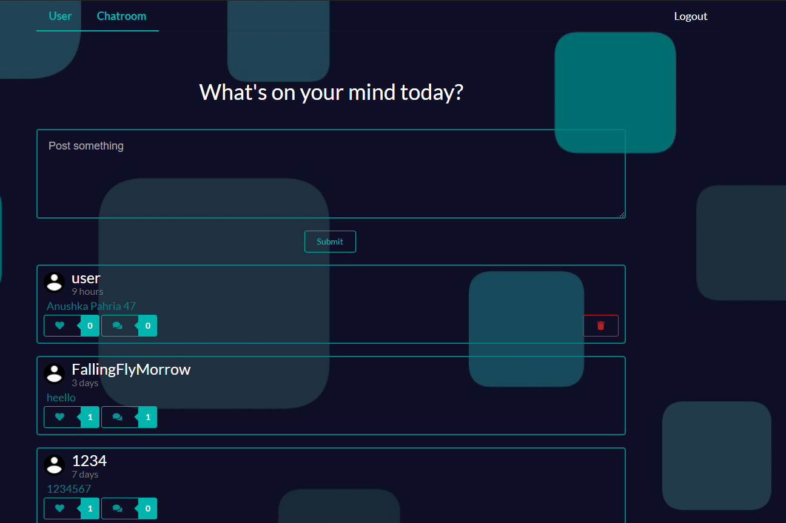
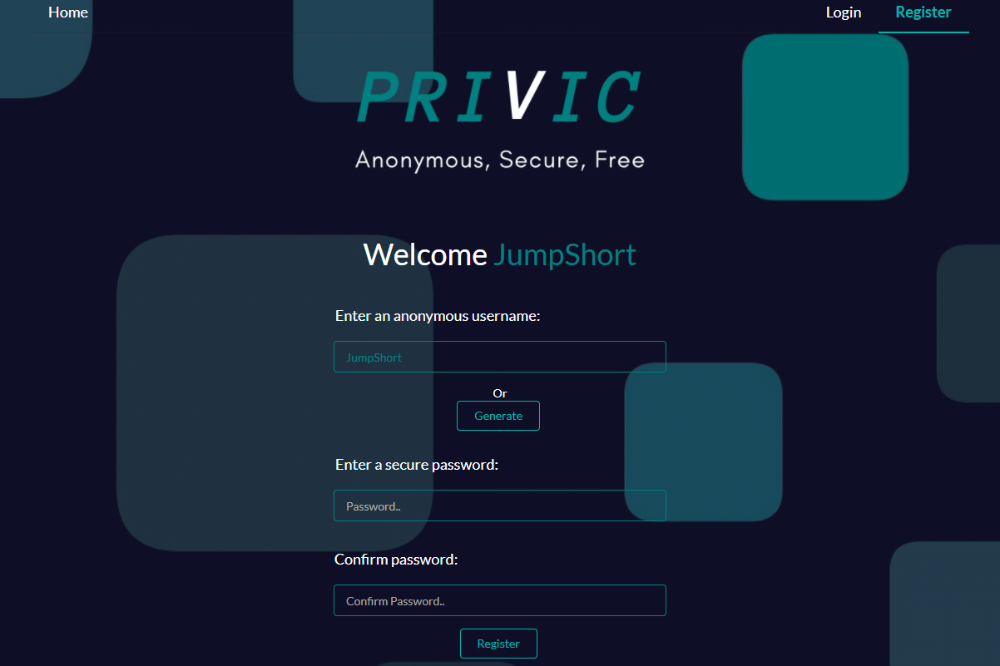

# Privic
Privic is an anonymous, secure and free social media application. Currently in development.

## Deployments
The app is deployed on https://privic.netlify.app/

## Table of contents
* [Description](#description)
* [Features](#features)
* [Setup](#setup)
* [Status](#status)
* [Preview](#preview)

## Description
A social media app that has User Authentication, CRUD posts and Chatroom functionality

### Technologies used
* Backend- Node.js, Express.js, MongoDB, GraphQL-Apollo Server, Socket.io
* Frontend - React, Semantic UI
* Deployed on- Netlify, Heroku

## Features

Following features have been implemented:
* Login/Create user account. Generate username
* Add/Remove Posts, Likes, Comments, have user details stored
* Create chatrooms and talk with other people in realtime, Generate room pin automatically
* Chatbot for answering queries and user experience

Following features are currently in development:
* Encrypt the chatroom messages
* Adding a User Card
* Adding an update functionality
* Making the web design mobile friendly and adding animations

## Setup
To run the app locally on your server, follow these steps-
### Cloning the repository
On your terminal, run the following command
``` 
 git clone https://github.com/satvik-tha-god/privic.git
 cd privic
```
### Setting up endpoints
#### To set up the chatroom endpoint

go to ``` privic/src/pages/Chat.js``` and set ``` const ENDPOINT = 'localhost:4000' ```

#### To set up the privic endpoint 

go to ``` privic/src/ApolloProvider.js ``` and set 

```
const httpLink = createHttpLink({
  uri: 'localhost:5000'
});
```
### Servers
#### Social Media
Run the following commands
```
cd server
npm start
```

The server will be running at ``` https://localhost:5000 ```

#### Chatroom
Run the following commands
```
cd chatroom-server
npm start
```

The server will be running at ``` https://localhost:4000 ```

#### Make sure you set these two up commands before running the app

### Client
This app was created using `create-react-app`
#### Start
In the project directory, you can run:

``` npm start ```

Runs the app in the development mode at ``` https://localhost:3000 ```

The page will reload if you make edits.

You will also see any lint errors in the console.
#### Test
``` npm test ```

Launches the test runner in the interactive watch mode.
#### Build
```npm run build```

Builds the app for production to the `build` folder.

It correctly bundles React in production mode and optimizes the build for the best performance.

The build is minified and the filenames include the hashes.

Your app is ready to be deployed!

#### Eject

### `npm run eject`

**Note: this is a one-way operation. Once you `eject`, you can’t go back!**

If you aren’t satisfied with the build tool and configuration choices, you can `eject` at any time. This command will remove the single build dependency from your project.

Instead, it will copy all the configuration files and the transitive dependencies (Webpack, Babel, ESLint, etc) right into your project so you have full control over them. All of the commands except `eject` will still work, but they will point to the copied scripts so you can tweak them. At this point you’re on your own.

You don’t have to ever use `eject`. The curated feature set is suitable for small and middle deployments, and you shouldn’t feel obligated to use this feature. However we understand that this tool wouldn’t be useful if you couldn’t customize it when you are ready for it.
## Status 
This app is currently in development. Feel free to contribute and open a pull request!
## Preview



